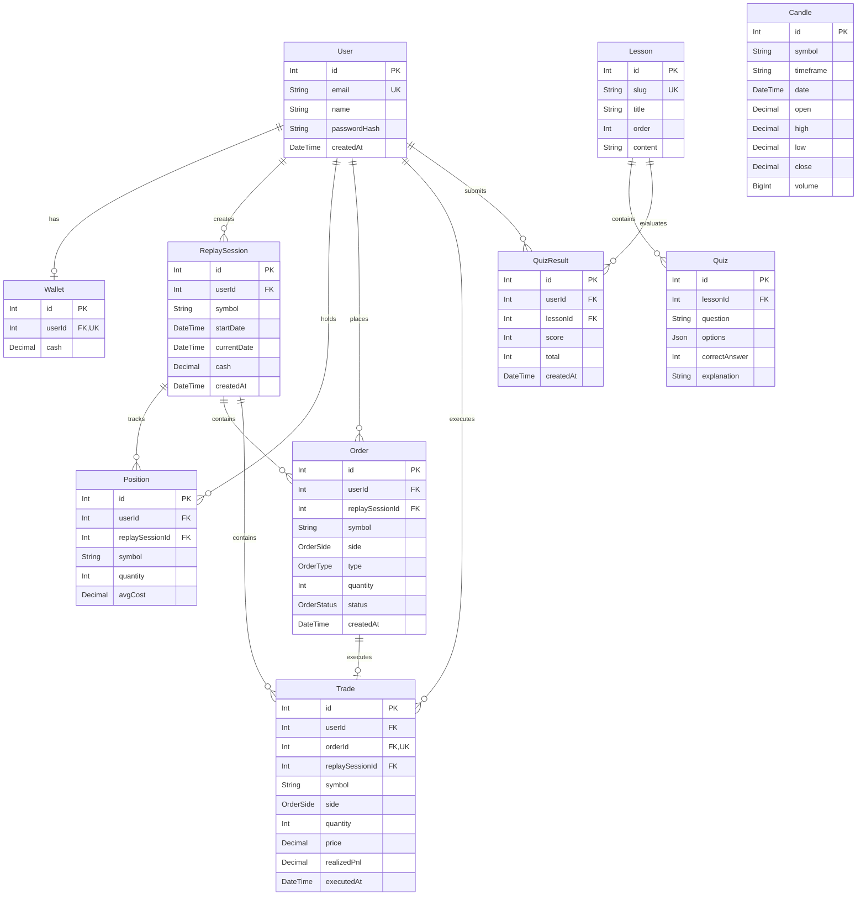

# ER Model

```mermaid
erDiagram
    User ||--o| Wallet : "has"
    User ||--o{ ReplaySession : "creates"
    User ||--o{ Position : "holds"
    User ||--o{ Order : "places"
    User ||--o{ Trade : "executes"
    User ||--o{ QuizResult : "submits"

    ReplaySession ||--o{ Position : "tracks"
    ReplaySession ||--o{ Order : "contains"
    ReplaySession ||--o{ Trade : "contains"

    Order ||--o| Trade : "executes"

    Lesson ||--o{ Quiz : "contains"
    Lesson ||--o{ QuizResult : "evaluates"

    User {
        Int id PK
        String email UK
        String name
        String passwordHash
        DateTime createdAt
    }

    Wallet {
        Int id PK
        Int userId FK,UK
        Decimal cash
    }

    Candle {
        Int id PK
        String symbol
        String timeframe
        DateTime date
        Decimal open
        Decimal high
        Decimal low
        Decimal close
        BigInt volume
    }

    ReplaySession {
        Int id PK
        Int userId FK
        String symbol
        DateTime startDate
        DateTime currentDate
        Decimal cash
        DateTime createdAt
    }

    Position {
        Int id PK
        Int userId FK
        Int replaySessionId FK
        String symbol
        Int quantity
        Decimal avgCost
    }

    Order {
        Int id PK
        Int userId FK
        Int replaySessionId FK
        String symbol
        OrderSide side
        OrderType type
        Int quantity
        OrderStatus status
        DateTime createdAt
    }

    Trade {
        Int id PK
        Int userId FK
        Int orderId FK,UK
        Int replaySessionId FK
        String symbol
        OrderSide side
        Int quantity
        Decimal price
        Decimal realizedPnl
        DateTime executedAt
    }

    Lesson {
        Int id PK
        String slug UK
        String title
        Int order
        String content
    }

    Quiz {
        Int id PK
        Int lessonId FK
        String question
        Json options
        Int correctAnswer
        String explanation
    }

    QuizResult {
        Int id PK
        Int userId FK
        Int lessonId FK
        Int score
        Int total
        DateTime createdAt
    }
```

